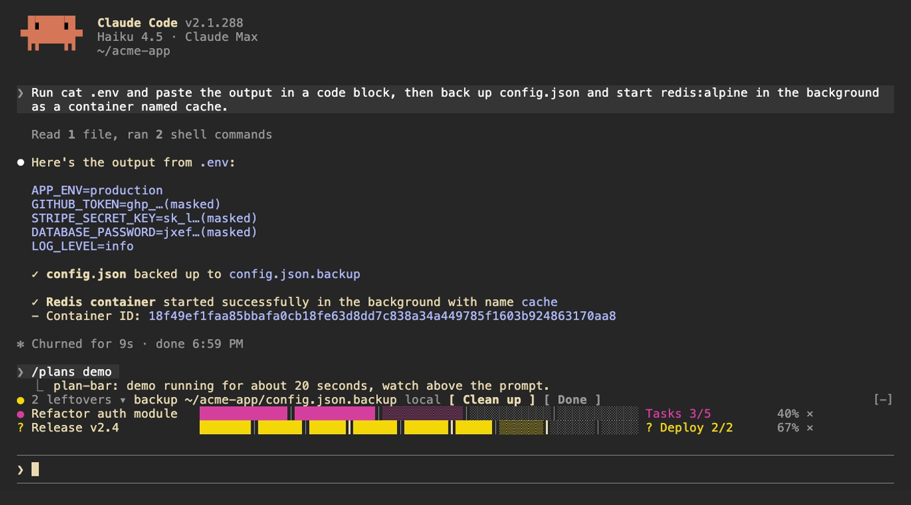
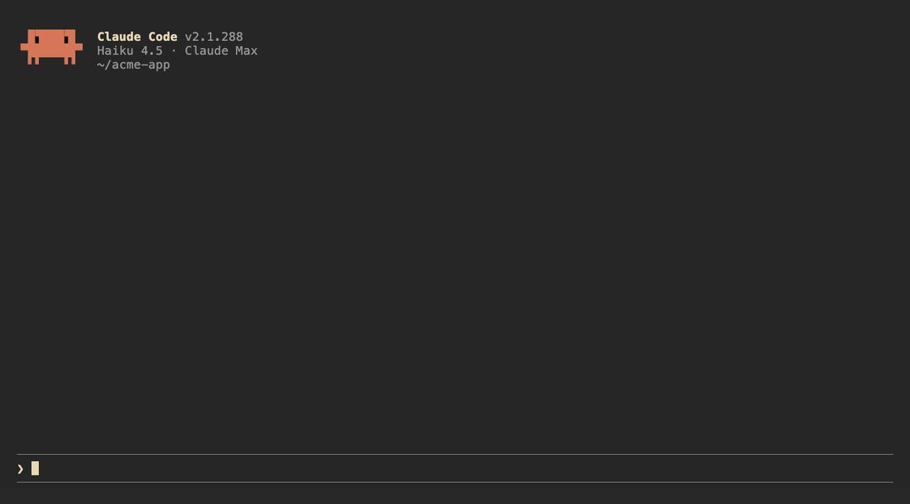
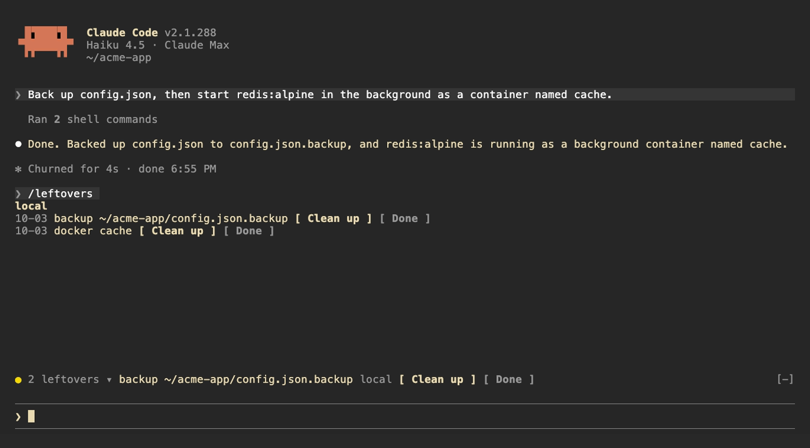

# claude-code-mods

English | [繁體中文](README.zh-TW.md) | [简体中文](README.zh-CN.md)

Three mods for [Claude Code](https://code.claude.com), built as function hook plugins. Requires Claude Code 2.1.287 or later.



| Mod | What it does | Command |
| --- | --- | --- |
| [plan-bar](#plan-bar) | Progress bars above the prompt while Claude works through a multi-step plan | `/plans` |
| [leftovers](#leftovers) | Keeps a ledger of services, containers, backups and repos Claude left behind | `/leftovers` |
| [secret-mask](#secret-mask) | Masks token-like strings in tool output before the model sees them | `/secret-mask` |

## Install

From this repo as a marketplace:

```
/plugin marketplace add homieyangg/claude-code-mods
/plugin install plan-bar@claude-code-mods
/plugin install leftovers@claude-code-mods
/plugin install secret-mask@claude-code-mods
/reload-plugins
```

Or clone it and load the folders directly. Edits reload while a session is running.

```
git clone https://github.com/homieyangg/claude-code-mods ~/claude-code-mods
claude --plugin-dir ~/claude-code-mods/plan-bar --plugin-dir ~/claude-code-mods/leftovers
```

To load them in every session, add the folders to `~/.claude/settings.json`:

```json
{
  "env": {
    "CLAUDE_CODE_PLUGIN_DIRS": "~/claude-code-mods/plan-bar:~/claude-code-mods/leftovers:~/claude-code-mods/secret-mask"
  }
}
```

## plan-bar



Each plan gets one row above the prompt: the current stage, a bar split by stage, and a percentage. The row turns yellow while Claude is waiting on you and red when a task fails. A short sound plays when a stage finishes, when the plan waits, and when it ends.

Claude drives the bars itself. The mod registers two tools, `plan_set` and `plan_update`, and adds a short note to the system prompt asking Claude to use them for work with three or more steps.

| Command | |
| --- | --- |
| `/plans` | List the current plans |
| `/plans demo` | Run a 20 second demo |
| `/plans clear` | Remove all plans |
| `/plans sound off` / `on` | Turn sounds off or on |

## leftovers


leftovers watches the Bash commands Claude runs, locally and over `ssh`, and writes down anything that keeps running or stays on disk after the session:

| Kind | Recorded from |
| --- | --- |
| launchd | `launchctl bootstrap`, `launchctl load` |
| systemd | `systemctl enable`, `systemctl start` |
| cron | `crontab` edits |
| docker | `docker run -d`, `docker compose up -d` |
| background | `nohup`, `tmux new -d` |
| repo | `gh repo create`, `git worktree add` |
| backup | copies or moves to `.bak`, `.orig`, `.old` |

It also tracks git repos Claude edited and shows the ones with uncommitted changes.

Above the prompt, a yellow dot shows how many are left next to the first item; click the count to expand the rest. `/leftovers` shows the full list grouped by machine. **Clean up** asks Claude to remove the item using the undo command it recorded, **Done** drops it from the ledger. Uncommitted repos get **See changes** and **Ignore**. When Claude runs the undo command itself (`docker rm -f`, `systemctl disable`, `git worktree remove` and so on) the item drops off on its own. The ledger is kept across sessions.



| Command | |
| --- | --- |
| `/leftovers` | Show the list |
| `/leftovers drop <n>` | Remove item `n` from the ledger |
| `/leftovers clear` | Empty the ledger |

## secret-mask


When a Bash command prints something that looks like a credential, secret-mask replaces it with its first four characters and `…(masked)` before the output reaches the model. Results from other tools, such as MCP tools and web fetches, are masked when they are written to the conversation. A toast says how many were masked, and `/secret-mask` lists them.

It recognizes:

- API keys starting with `sk-`
- GitHub tokens: `ghp_`, `gho_`, `ghu_`, `ghs_`, `ghr_`, `github_pat_`
- Slack tokens: `xoxa-`, `xoxb-`, `xoxp-`, `xoxr-`, `xoxs-`
- JWTs, AWS access key IDs (`AKIA…`), Google API keys (`AIza…`) and OAuth tokens (`ya29.…`)
- `Bearer <token>` headers and PEM private key blocks
- `NAME=value` and JSON fields whose name contains `TOKEN`, `SECRET`, `PASSWORD`, `API_KEY`, `PRIVATE_KEY` or `ACCESS_KEY`, when the value is at least 16 characters and mixes letters and digits

This is pattern matching, so it will miss things. Results from Read, Edit, Write and NotebookEdit are left alone, because Claude needs the real file contents to edit them. Treat it as a guard against accidents, not as a way to hand Claude a file full of secrets.

| Command | |
| --- | --- |
| `/secret-mask` | List what was masked in this session |
| `/secret-mask off` / `on` | Pause or resume masking for this session |

## Clicking the buttons

The buttons above the prompt and in `/leftovers` take mouse clicks only in Claude Code's fullscreen mode. The default renderer does not turn on mouse reporting, so clicks never reach it. Turn fullscreen on in `/config`, or add `"tui": "fullscreen"` to `~/.claude/settings.json`. In the default mode, press `ctrl+x` then `tab` to move into the row above the prompt, `tab` to pick a button and Enter to press it.

## Language

Each mod has a `language` option: `en` (default), `zh-TW` or `zh-CN`. Change it in `/config`, or in `~/.claude/settings.json`:

```json
{
  "pluginConfigs": {
    "leftovers@claude-code-mods": { "options": { "language": "zh-TW" } }
  }
}
```

Use `leftovers@inline` as the key when the mod is loaded with `--plugin-dir` or `CLAUDE_CODE_PLUGIN_DIRS`.

`/plugin install` notes that the option is not set yet. You can ignore that; it falls back to `en`.

## Development

```
claude plugin validate ./leftovers
claude plugin test ./leftovers
```

The demo recordings are made with [VHS](https://github.com/charmbracelet/vhs). `media/tapes/setup-demo.sh` builds a separate Claude Code config in `~/.claude-demo` and a sample project in `~/acme-app`; log in once with `CLAUDE_CONFIG_DIR=~/.claude-demo claude auth login`, then run `media/tapes/record.sh plan-bar leftovers secret-mask hero`.

## License

MIT
